# Overview

This repository contains instructions for creating a new AWS EC2 GPU instance suitable for getting starting with deep learning experiments. 

### Steps

1. How to create a new AWS EC2 instance.
2. How to access the  AWS EC2 instance.  

# Create AWS Instance

### Sign up for AWS account

New users to Amazon AWS have access to a free tier of services for the initial 12 months of subscription. Note that the GPU EC2 instance required for deep learning is not part of the free tier of services ($0.90/hour) however an Amazon AWS account is still required. 

To sign up, begin by visiting: https://portal.aws.amazon.com/billing/signup#/start 

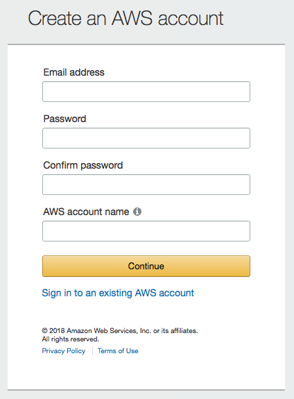

Note that your chosen `AWS account name` cannot contain spaces or non-alphanumeric characters (`{}[]()/\'"~,;:.<>`). Follow the prompts on the remaining screens. A valid credit card will be required.

### Login to EC2 console (dashboard)

Use the following link to log into your new AWS account: https://console.aws.amazon.com/console/home

On the following page, enter the email address of your AWS account and click `Next`:

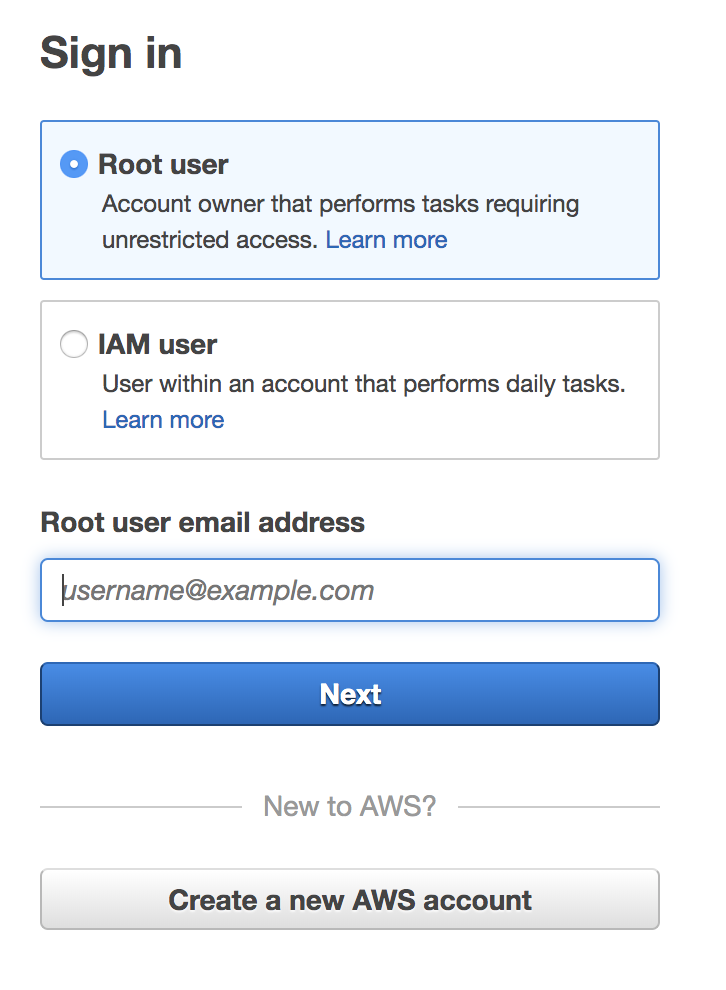

On the following page, enter the password of your AWS account and click `Sign In`:

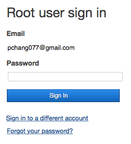

After logging in you will arrive at a launch page of various AWS services. We want to specifically manage EC2 instances. To navigate to the EC2 dashboard, click on the `Services` dropdown menu in the top left hand corner of the banner. You should now have a screen that looks like this:

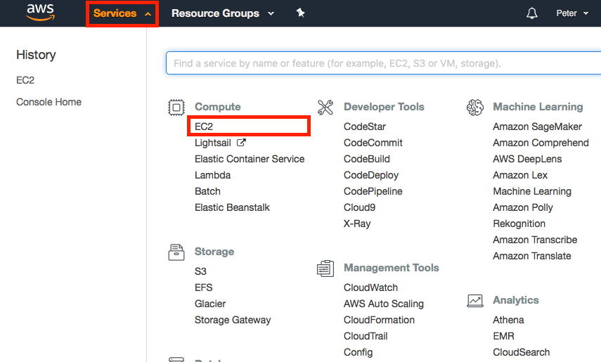

Click on the `EC2` link under the first `Compute` header within the first column. You have now arrived at the EC2 console (dashboard):

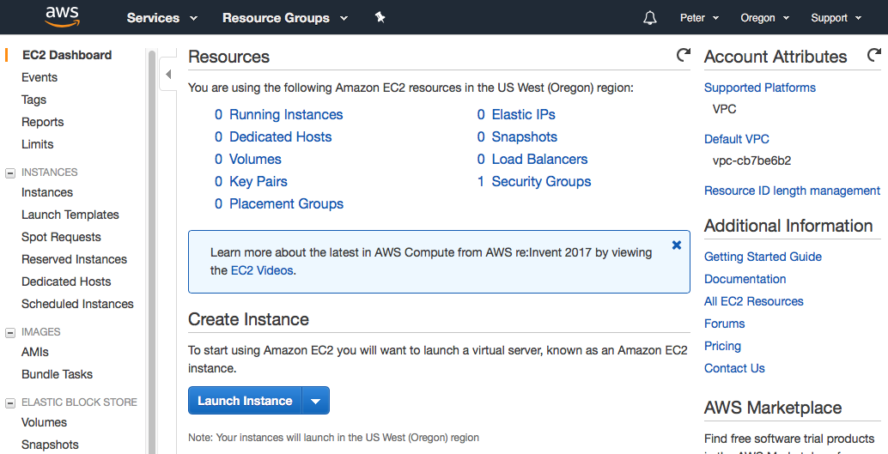

Here you can manage the servers in your AWS cloud, including creating, terminating, starting and stopping individual EC2 instances. For more general information about EC2 services and the console, see Amazon documentation here: https://aws.amazon.com/ec2/getting-started/ 

### Update AWS EC2 region

The EC2 instance we will create will be generated from a preconfigured Amazon Machine Image (AMI). To ensure that this AMI is visible to your AWS account, make sure you are in the `US West (Oregon)` region of service by changing the context in the top right hand corner of the banner as needed:

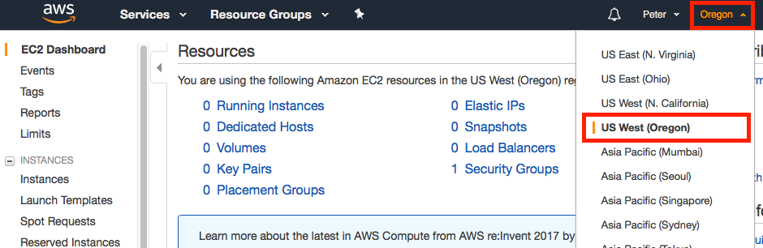

### Request a GPU instance limit increase

By default Amazon does not allow a user to create a new GPU-based instance to prevent accidental incurrence of charges. To request that AWS increase your GPU limit from 0 to 1, click on the `Limits` link on the EC2 console. Scroll down until you see the `p2.xlarge` selection and click on the corresponding link for `Request limit increase`. 

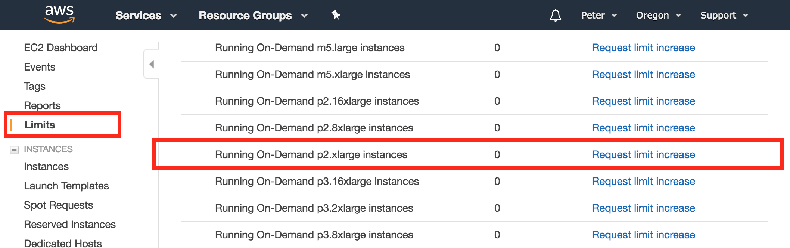

Complete the following request with the settings shown below. Ensure that the correct region and instance type are selected:

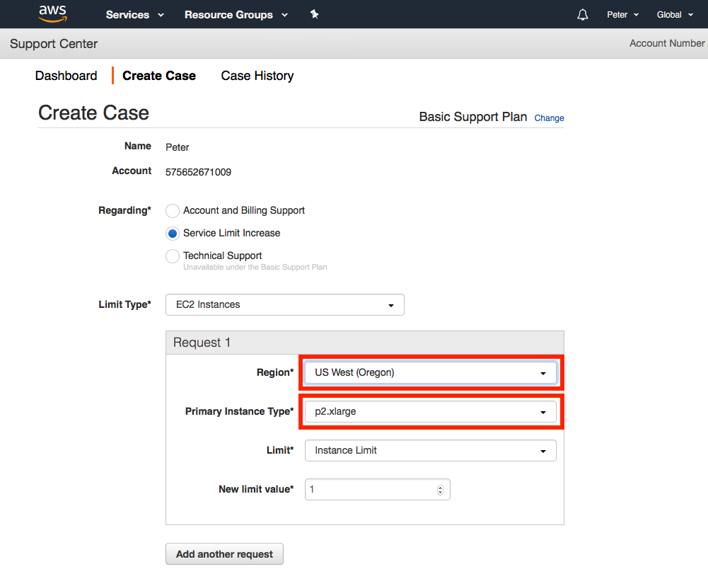

### Create a new EC2 instance

After recieving notification of successful limit increase, log into the EC2 console (see instructions above) to begin creating a new EC2 instance. Click the `Instances` link on the left hand toolbar and subsequently click on the blue `Launch Instance` button.

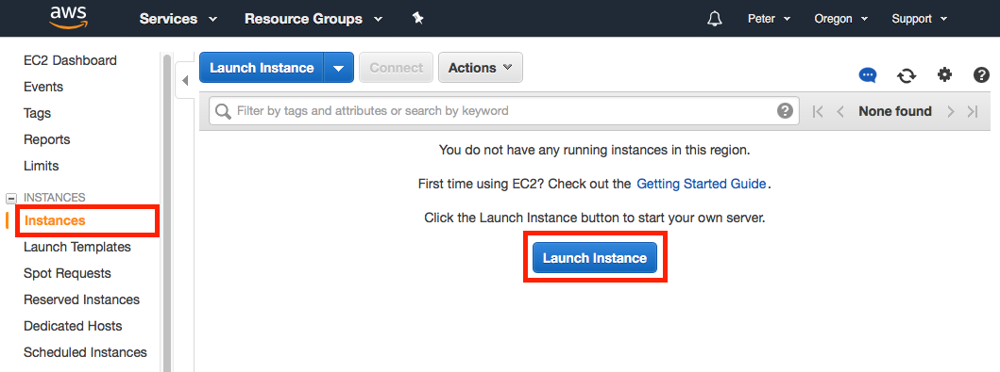

At this point, select a template image to use as the base installation (OS and associated software). There are a number of prebuilt images optimized for deep learning availabe for ease of use, several of which are listed here (any of the following may be selected). Note that for those without significant experience with Linux based OS, either Ubuntu or Amazon Linux are good recommended choices for OS:

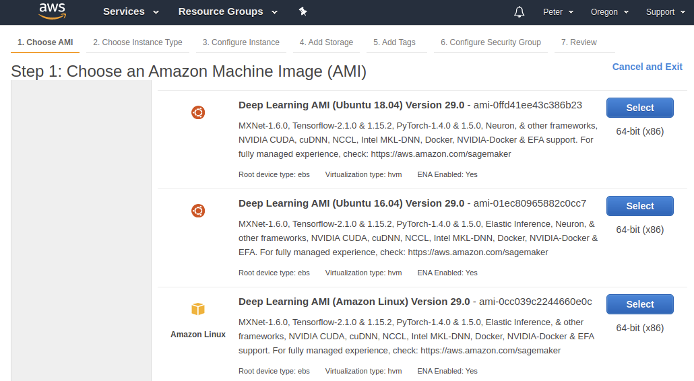

For the second step, we need to choose the EC2 instance type. Scroll down the page until you get to `p2.xlarge` in the Instance Type column. This is the baseline single GPU instance.

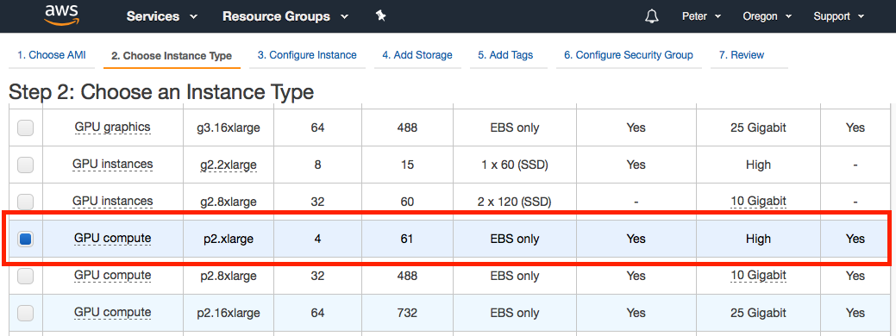

On the top set of links, click on `Add Storage` to configure the storage settings for the EC2 instance. Free tier users recieve up to 30 GiB of storage without charge, so we will configure this instance with 30 GiB of SSD storage. 

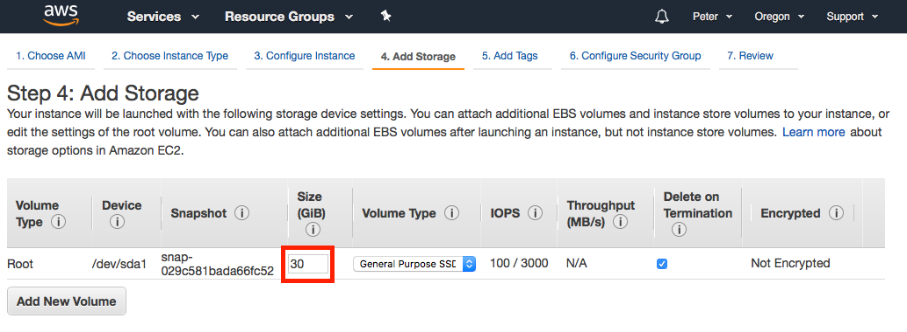

On the top set of links, click on `Add Tags` to name your new EC2 instance (for your own personal benefit in case you may have multiple EC2 instances to keep track of). In the middle of the screen click the link for `click to add a Name tag` and complete with an appropriate name:

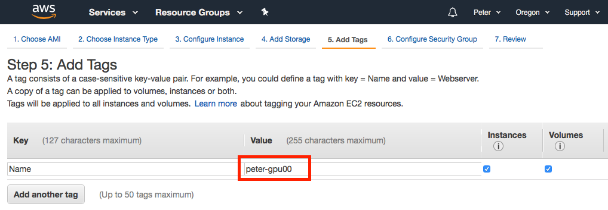

On the top set of links, click on `Configure Security Group` to set up port firewall settings. First we will create an arbitrary name for this profile of settings by changing `Security group name` and `Description` to `deep-learning`. By default port 22 (for SSH) is allowed. In addition we must open the default Jupyter notebook port 8000 to allow you to connect to the EC2 instance and edit code through a web browser. To do so, click `Add Rule` and fill in the following settings:

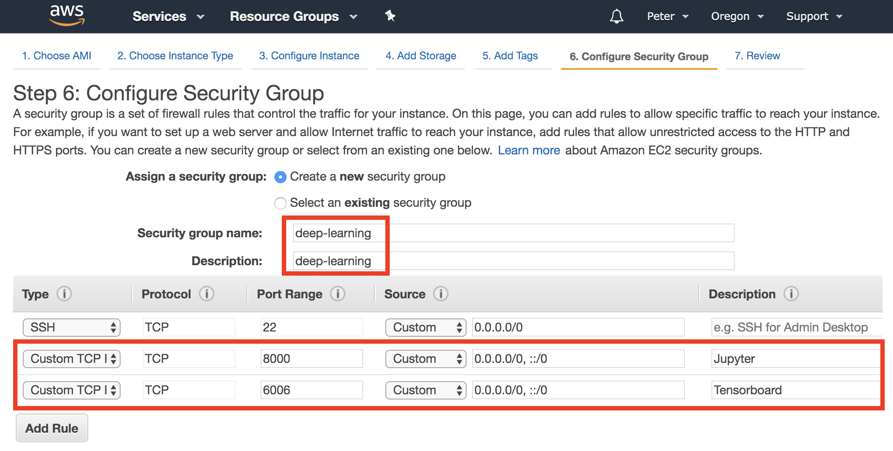

On the top set of links, click on `Review` to see a summary of the EC2 settings. Click on the bottom right hand `Launch` button.

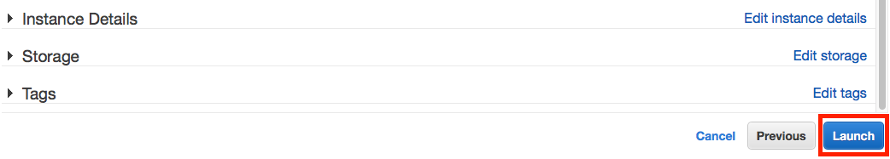

The final step is to create an SSH key pair to remotely connect to your EC2 instance. To do so type in a key pair name (`default`) and click `Download Key Pair`. It is important to remember the name and location of this downloaded key. If you lose this key you will be unable to access the EC2 instance. A recommended strategy to store AWS key pairs is to place it in a hidden folder easily accessible from your home folder (`~/.aws`). After downloading and saving the SSH key, click `Launch Instance` to complete the EC2 creation process.

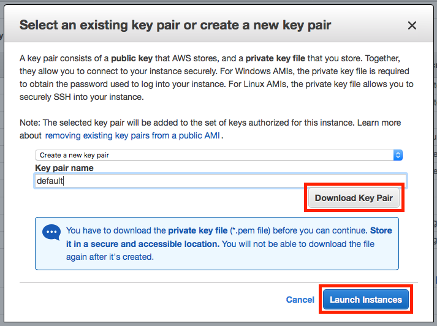

Before continuing, open a terminal and navigate to the location of your saved key. If you did not create a `~/.aws` folder to place your key and would like to do so now, use the following commands:
```
mkdir ~/.aws
mv name_of_your_key.pem ~/.aws/default.pem
```

Note that some OS's may automatically append a `*.txt` to the end of your `*.pem` file when downloading. If so the `mv` command above wil rename your file appropriately. At this time, also go ahead and change the permissions on the SSH key to not be publically viewable (otherwise SSH client will not accept the key):
```
chmod 400 ~/.aws/default.pem
```

# Accessing AWS Instance

### Launch EC2 instance 

Upon completing the EC2 instance creation steps described above, the new EC2 instance will be automatically be started. On each subsequent future session, you will have to start (e.g. boot) your EC2 instance before you can connect and use it. To do so, select the `Instances` link on the left hand toolbar, select the instance you want to boot (blue check box to the left of the instance name), select `Actions` > `Instance State` > `Start`. Your EC2 instance will be ready to connect in about 30-60 seconds.

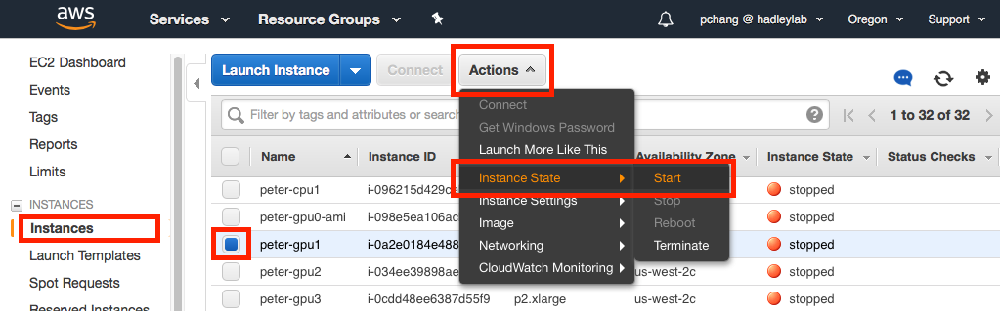

### SSH into EC2 instance

There are two options to start a remote connection to your EC2 instance. Instructions can be found by selecting a particular EC2 instance (blue check box to the left of the instance name) and clicking the `Connect` button. 

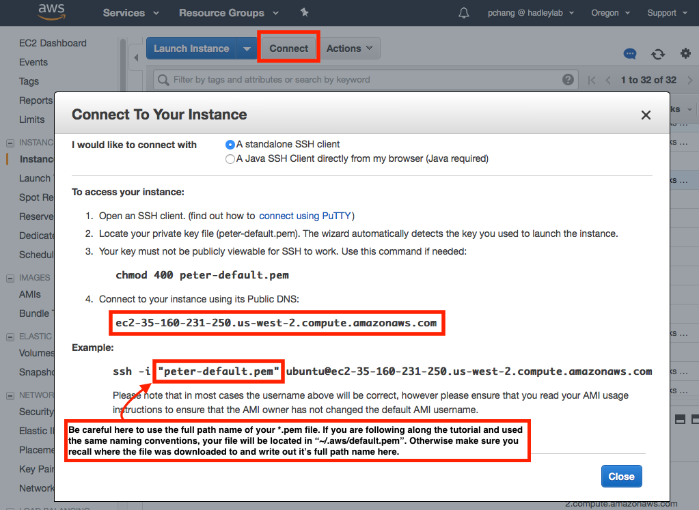

The recommended option is to connect through a standalone SSH client (from your local machine) of your choice. For Mac OS X users, the default SSH client located in the Terminal appliation (Applications > Utilities) is recommended. After opening a terminal session, type in the following command:
```
ssh -i "/path/to/your/pem/file" ubuntu@[ec2-public-dns]
``` 
Note the you should replace [ec2-public-dns] with your EC2 instances public DNS. In the above screenshot this would be `c2-35-160-231-250.us-west-2.compute.amazonaws.com`. Assuming that your SSH key is located at `~/.aws/default.pem` (if you followed the instructions per EC2 creation above) then the full command would be:
```
ssh -i "~/.aws/default.pem" ubuntu@c2-35-160-231-250.us-west-2.compute.amazonaws.com
```

You should now be successfully logged into your remote SSH session. 

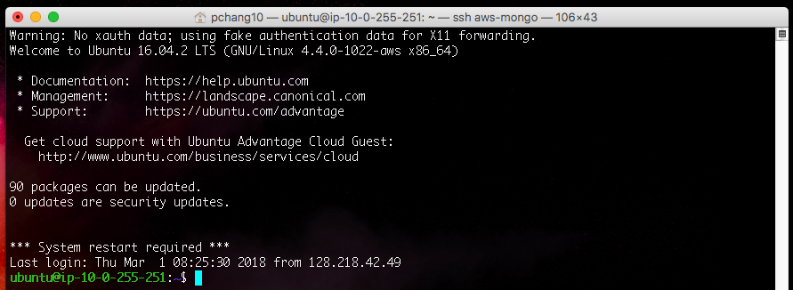

### Stop EC2 instance 

AWS charges a fixed cost per hour of EC2 instance usage, prorated to the second. To keep your charges low, it is advised to stop (e.g. turn off) your EC2 instance whenever your are finished. To do so, select the `Instances` link on the left hand toolbar, select the instance you want to stop, select `Actions` > `Instance State` > `Stop`.
